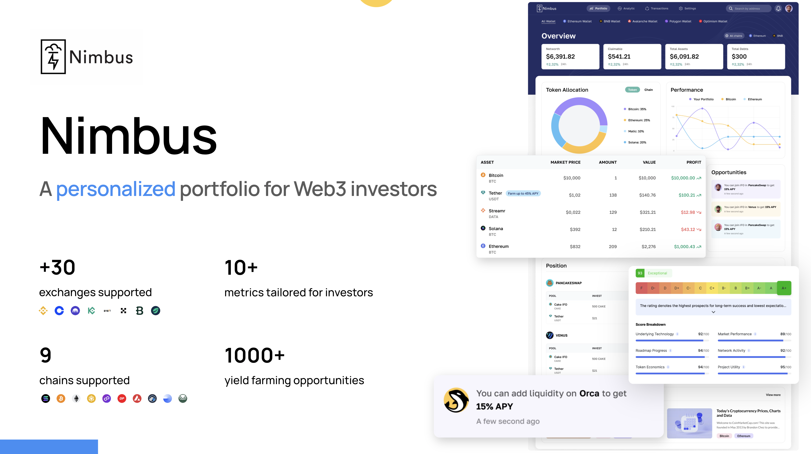

# Nimbus - A personalized portfolio tool for Web3 investors



Website: https://getnimbus.io

## Project Setup

```sh
yarn install
```

## Commands

### Build

#### Development, HMR

```sh
yarn run dev
```

Then after that, load the unpacked extension to the browser under `dist` foler

#### Production

Minifies and optimizes extension build

```sh
yarn run build
```

### Load extension in browser

Loads the contents of the dist directory into the specified browser

```sh
yarn run serve:chrome
```

```sh
yarn run serve:firefox
```
